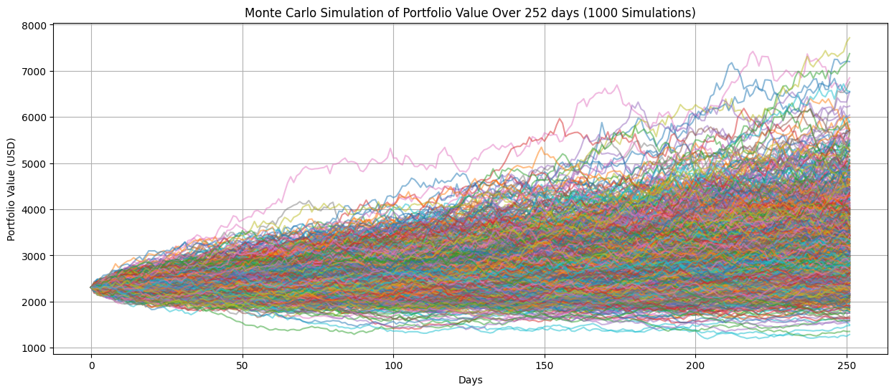
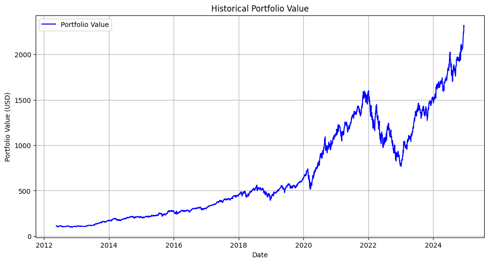
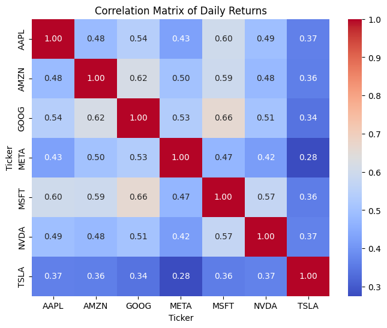
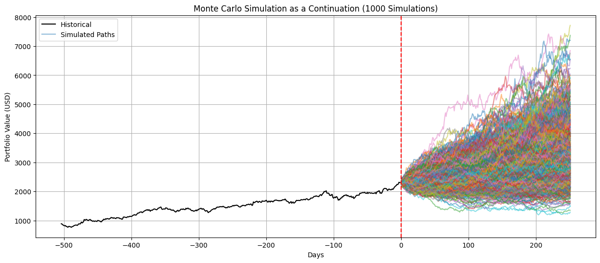
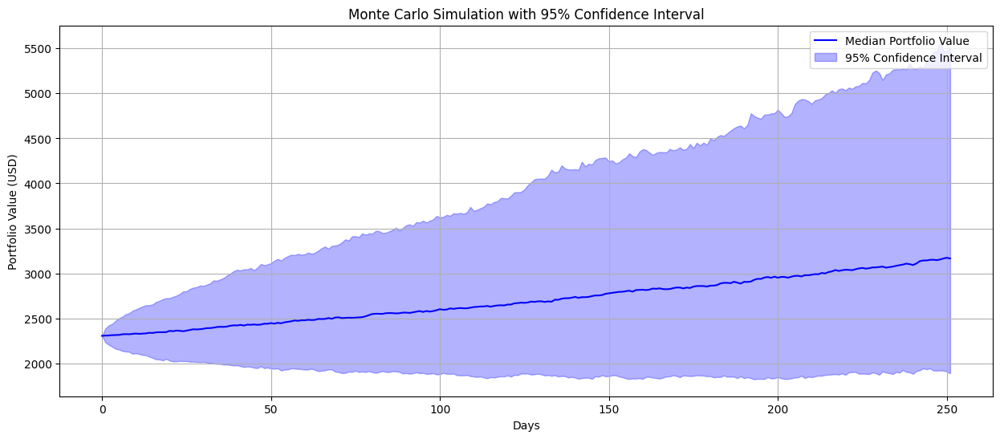
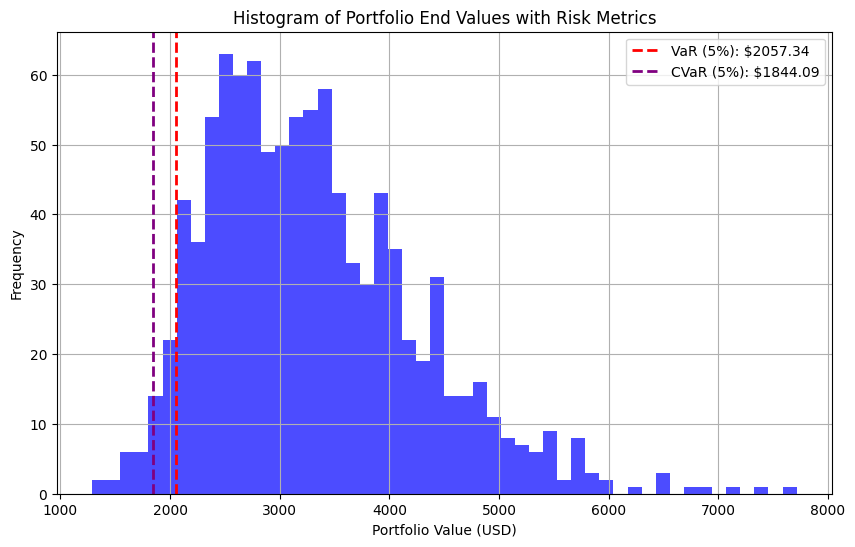
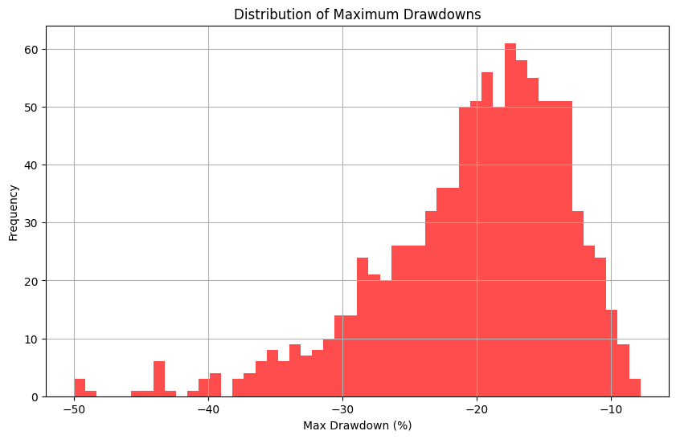
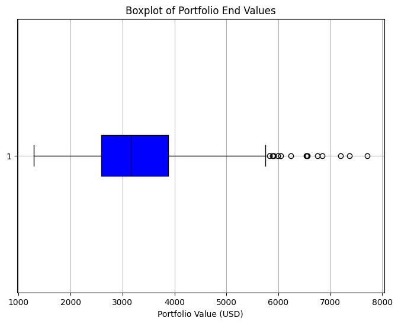

# Stock Portfolio Risk Assessment using Monte Carlo Simulation

Notebook created by [Mattia Loszach](https://mattia-loszach.com)

**Disclaimer:** This notebook should be used as a tool for scenario analysis and risk assessment, not as a standalone forecast.

---

## Choose your assets
This code allows selecting assets and specifying their quantities using ticker symbols from the Yahoo Finance API. For missing or unknown tickers, check the [Yahoo Finance Website](https://finance.yahoo.com). Start by running the following code cell and you will be able to input the assets.

- Example using the Magnificent Seven (Stocks):

## Choose Parameters for Simulation
By default, periods is set to 252 days, representing a typical trading year in the stock market, and simulations is set to 1000 runs. Users can customize these parameters to suit their preferences.

## Context & Run simulation

This simulation models the price evolution of multiple assets using the [Geometric Brownian Motion (GBM)](https://en.wikipedia.org/wiki/Geometric_Brownian_motion) in a multivariate context, which accounts for asset correlations.

---

### 1. **Drift and Volatility**
The drift term $\mu$ and volatility term $\sigma$ for each asset are calculated from historical daily returns:

- $\mu_i = \text{mean of daily returns for asset } i$
- $\sigma_i = \text{standard deviation of daily returns for asset } i$

The drift for the simulation is adjusted using:

$$
\text{Drift} = \mu - \frac{1}{2} \sigma^2
$$

This adjustment ensures consistency with the GBM model.

---

### 2. **Correlation Matrix and Cholesky Decomposition**
To model dependencies between assets, the correlation matrix $\mathbf{C}$ is calculated from the historical daily returns. The **Cholesky decomposition** is used to transform independent standard normal random variables into correlated random variables:

$$
\mathbf{L} \text{ such that } \mathbf{C} = \mathbf{L} \mathbf{L}^\top
$$

---

### 3. **Random Sampling**
For $n_{\text{simulations}}$ Monte Carlo simulations over $T$ periods, random standard normal variables are generated:

$$
Z_{i,t} \sim \mathcal{N}(0, 1)
$$

These are transformed into correlated random values using:

$$
\text{Correlated Random Values} = \mathbf{L} \cdot \mathbf{Z}
$$

---

### 4. **Asset Price Evolution**
Using the GBM formula, the simulated prices are calculated iteratively:

$$
S_{i, t+1} = S_{i, t} \cdot \exp\left( \text{Drift}_i \cdot \Delta t + \sigma_i \cdot \sqrt{\Delta t} \cdot \text{Correlated Random Values}\right)
$$

Where:

- $S_{i, t}$ is the price of asset $i$ at time $t$,
- $\Delta t = 1$ represents daily time steps.

---

### 5. **Portfolio Value**

The simulated portfolio value is computed as the weighted sum of asset prices, based on the number of shares held:

Vportfolio, t = &sum;i=1N Sharesi &middot; Si, t

---

### Summary of Code Steps:
1. **Drift and Volatility**: Pre-compute drift and volatility terms for each asset.
2. **Cholesky Decomposition**: Use the correlation matrix to generate correlated random samples.
3. **Simulated Prices**: Use the GBM formula iteratively for price evolution.
4. **Portfolio Value**: Aggregate asset values to get the portfolio value at each step.

---

## Results

### Interpreting Monte Carlo Simulation Results

Monte Carlo simulations provide a powerful framework for analyzing the potential future performance of a portfolio. However, it is crucial to understand their limitations and how to interpret the results effectively:

1. **Visual Exploration**: 
   - The results can be visualized in various ways, such as line plots, histograms, confidence intervals, and boxplots. Each visualization highlights different aspects of the portfolio's behavior, such as overall trends, risk, and uncertainty.

2. **Guidance, Not Prediction**:
   - These simulations do not predict the market or asset prices with absolute accuracy. Instead, they offer guidance by providing a range of possible outcomes based on historical data and assumptions about volatility, drift, and correlations.

3. **Key Metrics**:
   - Statistical measures such as the mean, median, standard deviation, and percentiles (e.g., 5th and 95th) help quantify risk and expected returns.
   - Value-at-Risk (VaR) and Conditional Value-at-Risk (CVaR) give insights into potential losses under adverse conditions.

4. **Use in Decision-Making**:
   - Simulations should be used as a tool for scenario analysis and risk assessment, not as a standalone forecast.

By combining graphical analysis and key metrics, Monte Carlo simulations allow investors to evaluate the uncertainty in portfolio performance and make more informed decisions.

---

## Some examples of visualizations/graphs in the Notebook

